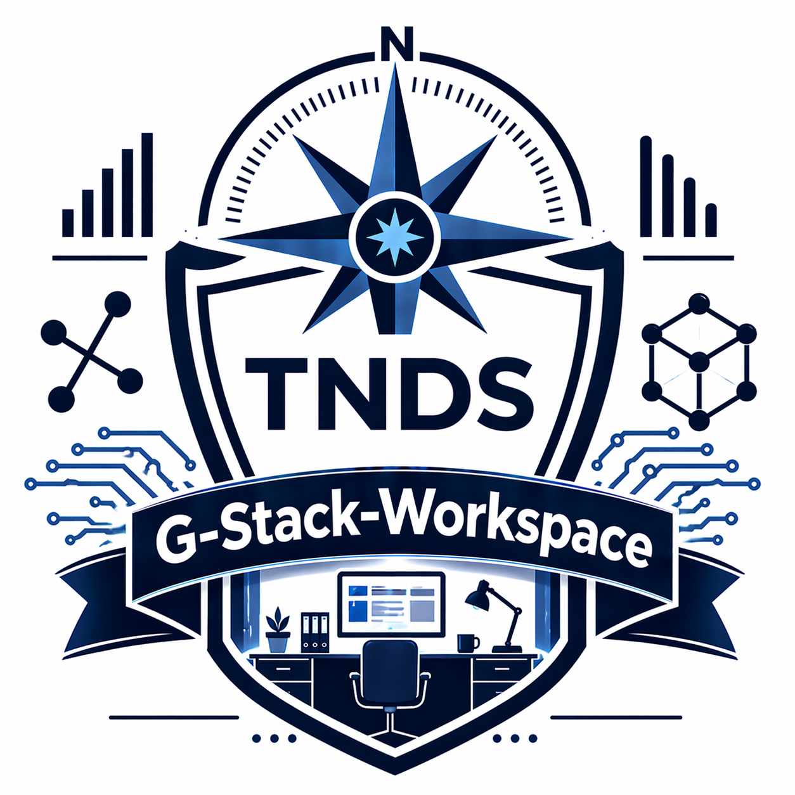

<div align="center">

# G-Stack Workspace
### Google Workspace Operations Toolkit for Drive and Gmail automation

[](https://nodejs.org)
[](LICENSE)
[](https://truenorthstrategyops.com)



</div>

## What this is

G-Stack Workspace is a Google Apps Script toolkit deployed from a Node setup flow. It installs operational controls in a Google Sheet to standardize Drive structure and Gmail organization by industry template. The repo is client-agnostic and designed for repeatable deployment.

## What it does

- Builds standardized Drive folder hierarchies
- Creates nested Gmail labels and applies auto-label rules
- Provides a sheet-based function runner for operational tasks
- Ships industry templates for rapid onboarding
- Supports interactive and batch setup via `setup/setup.js`

## How it works

```text
setup/setup.js -> template substitution -> clasp create/push -> bound Google Sheet UI
```

## Quick start

```bash
npm install -g @google/clasp
clasp login
node setup/setup.js
# or
node setup/setup.js --config my-config.json
```

## Project structure

```text
core/      Apps Script modules
ui/        HtmlService dialogs
setup/     Node deployment wizard
docs/      Operator documentation
tests/     Apps Script test files
```

## License

MIT. See [LICENSE](LICENSE).

## Support

jacob@truenorthstrategyops.com | 719-204-6365

## Built by

Jacob Johnston | True North Data Strategies LLC | SDVOSB